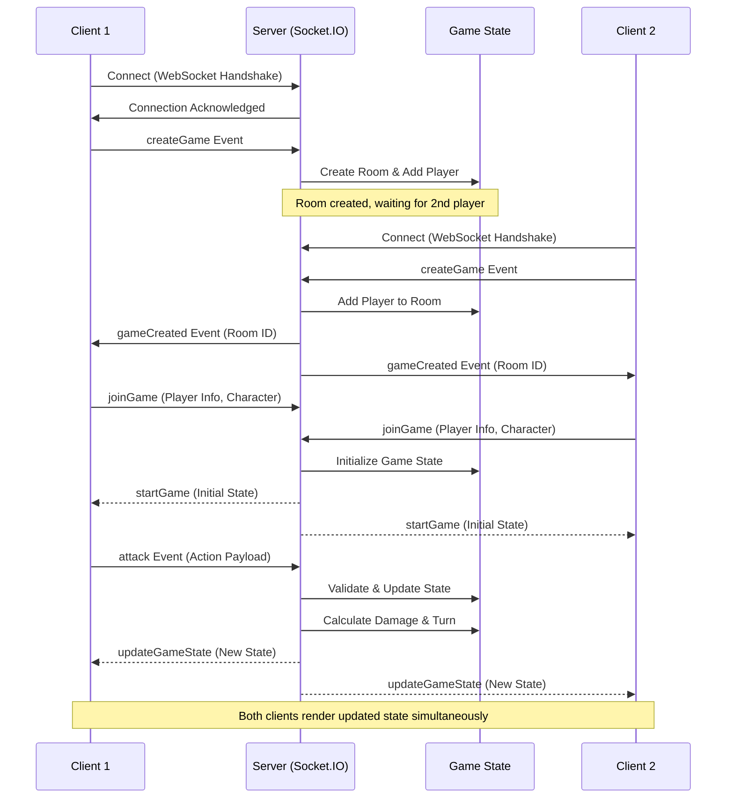

# Real-Time State Synchronization Engine

[](https://nodejs.org/)
[](https://socket.io/)
[](https://developer.mozilla.org/en-US/docs/Web/API/WebSockets_API)
[](https://developer.mozilla.org/en-US/docs/Web/JavaScript)
[](https://expressjs.com/)

> A **high-performance real-time multiplayer engine** demonstrating bidirectional state synchronization using WebSockets and Node.js. This project showcases production-grade patterns for building scalable, event-driven systems with low-latency client-server communication.

## 🎯 Key Features

### Real-Time Communication
- **Persistent WebSocket Connections**: Eliminates HTTP overhead with full-duplex communication channels
- **Sub-100ms Latency**: Optimized event loop for near-instantaneous state propagation
- **Broadcast Architecture**: Efficient room-based state distribution to multiple clients

### State Management
- **Server-Authoritative Model**: Centralized game state prevents client-side manipulation
- **Deterministic State Updates**: Predictable state transitions with conflict resolution
- **In-Memory State Store**: High-performance state access with O(1) lookups

### Technical Highlights
- **Event-Driven Architecture**: Decoupled event handlers for scalable message processing
- **Room-Based Multiplayer**: Dynamic room creation and player matchmaking
- **Client-Side Prediction**: Optimistic UI updates for responsive user experience
- **Graceful Disconnect Handling**: Automatic cleanup and state reconciliation

---

## 🏗️ Architecture Overview

### System Design

This engine implements a **server-authoritative architecture** where all game logic and state mutations occur server-side, ensuring consistency across all connected clients.

```
┌─────────────┐         WebSocket          ┌─────────────┐
│             │ ──────── Event ──────────> │             │
│   Client A  │                             │   Node.js   │
│  (Browser)  │ <──── State Broadcast ──── │   Server    │
└─────────────┘                             │             │
                                            │  Socket.IO  │
┌─────────────┐         WebSocket          │             │
│             │ ──────── Event ──────────> │   Express   │
│   Client B  │                             │             │
│  (Browser)  │ <──── State Broadcast ──── └─────────────┘
└─────────────┘                                    │
                                                   │
                                            ┌──────▼──────┐
                                            │  In-Memory  │
                                            │  Game State │
                                            │   Store     │
                                            └─────────────┘
```

### Data Flow Sequence



### Why WebSockets Over HTTP/REST?

| Aspect | WebSockets | HTTP/REST |
|--------|------------|-----------|
| **Connection Model** | Persistent, bidirectional | Request-response, stateless |
| **Latency** | ~10-50ms (no handshake overhead) | ~100-300ms (TCP + TLS handshake) |
| **Header Overhead** | Minimal (2-14 bytes per frame) | 500-800 bytes per request |
| **Server Push** | Native support | Requires polling or SSE |
| **Use Case Fit** | Real-time, event-driven | CRUD, stateless operations |

**Decision Rationale**: For a real-time multiplayer system requiring <100ms latency and server-initiated updates, WebSockets eliminate the need for polling and reduce bandwidth consumption by ~90% compared to HTTP long-polling.

---

## 🔧 How It Works

### Server Event Loop & State Synchronization

The server operates on Node.js's single-threaded event loop, processing events asynchronously:

1. **Event Reception**: Socket.IO receives client events (e.g., `attack`, `chatMessage`)
2. **State Mutation**: Server updates the authoritative game state in memory
3. **State Broadcast**: Updated state is emitted to all clients in the room via `io.to(roomId).emit()`
4. **Client Rendering**: Clients receive state and update UI reactively

**Tick Rate**: Event-driven (no fixed tick rate). State updates occur on-demand when clients emit actions, ensuring minimal server load during idle periods.

### Conflict Resolution & State Divergence

- **Turn-Based System**: Prevents simultaneous state mutations by enforcing turn order
- **Server Validation**: All actions are validated server-side before state updates
- **Atomic State Updates**: State changes are applied atomically to prevent partial updates
- **Timestamp-Free Design**: Turn-based nature eliminates need for complex timestamp reconciliation

### Room Management

```javascript
// Dynamic room creation with automatic matchmaking
socket.on('createGame', () => {
  const roomId = roomCounter;
  socket.join(roomId);
  
  if (games[roomId].length === 2) {
    io.to(roomId).emit('gameCreated', roomId);
    roomCounter++;
  }
});
```

**Key Implementation Details**:
- Rooms are created on-demand when first player joins
- Second player triggers game initialization
- Each room maintains isolated state (no cross-room interference)

---

## 💡 Technical Challenges & Solutions

### Challenge 1: Handling Unexpected Disconnects

**Problem**: Players disconnecting mid-game leaves the opponent in a broken state.

**Solution**:
```javascript
socket.on('disconnect', () => {
  for (const roomId in games) {
    games[roomId] = games[roomId].filter(id => id !== socket.id);
    if (games[roomId].length === 0) {
      delete games[roomId];
    }
  }
});
```
- Automatic room cleanup when both players disconnect
- State garbage collection prevents memory leaks
- Future enhancement: Implement reconnection grace period

### Challenge 2: Synchronizing Complex State (Health, Turns, Characters)

**Problem**: Multiple state variables must update atomically to prevent inconsistencies.

**Solution**:
- Server maintains single source of truth (`gameStateDb`)
- State updates are atomic (all properties updated before broadcast)
- Clients receive complete state objects, eliminating partial update risks

### Challenge 3: Minimizing Latency for Global Players

**Problem**: Network latency varies by geographic location.

**Solution**:
- Optimistic UI updates (client predicts outcome before server confirmation)
- Minimal payload sizes (only delta changes sent)
- Future enhancement: Regional server deployment with load balancing

---

## 🚀 Getting Started

### Prerequisites

- **Node.js** v18 or higher ([Download](https://nodejs.org/))
- **npm** (bundled with Node.js)

### Installation

1. **Clone the Repository**
   ```bash
   git clone https://github.com/Gh0stbasta/bloodKatana.git
   cd bloodKatana
   ```

2. **Install Dependencies**
   ```bash
   npm install
   ```

3. **Start the Server**
   ```bash
   npm run dev
   ```
   The server will start on `http://localhost:3000`

### Testing Multiplayer Functionality

To test real-time synchronization, open **two browser windows**:

1. **Window 1**: Navigate to `http://localhost:3000`
   - Enter player name and select a character
   - Click "Join Match"

2. **Window 2**: Navigate to `http://localhost:3000` (in a new window/tab)
   - Enter a different player name and select a character
   - Click "Join Match"

Both clients will be matched into the same room and the game state will synchronize in real-time.

### Observing State Synchronization

Open browser DevTools (F12) → Network tab → WS (WebSocket) to inspect:
- Connection handshake
- Event payloads (`attack`, `updateGameState`)
- State broadcast messages

---

## 📊 Tech Stack

### Backend
- **Node.js**: Asynchronous, event-driven JavaScript runtime
- **Express**: Minimalist web framework for HTTP server
- **Socket.IO**: WebSocket library with fallback support (polling)
- **In-Memory Store**: Fast state access with JavaScript objects

### Frontend
- **Vanilla JavaScript**: Zero-dependency client-side logic
- **Socket.IO Client**: Browser WebSocket implementation
- **HTML5/CSS3**: Modern, responsive UI

### Protocol
- **WebSocket (RFC 6455)**: Full-duplex communication over TCP
- **JSON**: Structured data serialization format

---

## 📁 Project Structure

```
bloodKatana/
│
├── backend/
│   └── server.js           # Socket.IO server, event handlers, game logic
│
├── frontend/
│   ├── dashboard.html      # Matchmaking UI
│   ├── arena.html          # Game arena UI
│   ├── js/
│   │   ├── dashboard.js    # Client-side matchmaking logic
│   │   └── arena.js        # Client-side game logic
│   ├── css/                # Stylesheets
│   └── images/             # Static assets
│
├── package.json            # Dependencies and scripts
└── README.md               # This file
```

---

## 🔍 Key Code Snippets

### Server-Side State Update (Attack Handler)

```javascript
socket.on('attack', ({ roomId, playerName, attackType }) => {
  const game = games[roomId];
  if (!game || game.length < 2) return;

  // Calculate damage based on character stats & attack type
  let damage = attackValue * (Math.random() * 0.4 + 0.8);
  
  // Apply attack modifiers
  switch (attackType) {
    case 'schatten':
      if (Math.random() < 0.3) damage *= 1.5; // 30% crit chance
      break;
    case 'tod':
      damage = Math.random() < 0.2 ? damage * 2 : 0; // High risk/reward
      break;
  }

  // Update authoritative state
  gameStateDb[roomId].enemyHealth -= damage;
  gameStateDb[roomId].playerTurn = opponent;

  // Broadcast to all clients in room
  io.to(roomId).emit('updateGameState', { gameState: gameStateDb[roomId] });
});
```

### Client-Side State Subscription

```javascript
socket.on('updateGameState', ({ gameState }) => {
  clientGamestate = gameState; // Update local state
  
  // Re-render UI reactively
  updateHealthBars(gameState.playerHealth, gameState.enemyHealth);
  updateTurnIndicator(gameState.playerTurn);
});
```

---

## 🎓 Learning Outcomes

This project demonstrates proficiency in:

- **Event-Driven Systems**: Designing scalable, message-based architectures
- **Real-Time Protocols**: Implementing WebSocket-based communication
- **State Management**: Building server-authoritative models with conflict resolution
- **Concurrent Programming**: Handling asynchronous operations in Node.js
- **API Design**: Creating intuitive, well-structured event schemas
- **Performance Optimization**: Minimizing latency and bandwidth usage

---

## 🛠️ Future Enhancements

- **Reconnection Logic**: Gracefully handle temporary disconnects with state recovery
- **Database Persistence**: Store game history in SQLite/PostgreSQL
- **Redis Integration**: Distributed state management for horizontal scaling
- **Load Balancing**: Nginx reverse proxy with sticky sessions
- **Monitoring**: Prometheus metrics + Grafana dashboards
- **Rate Limiting**: Prevent spam attacks and DoS vulnerabilities

---

## 📄 License

ISC License - see package.json for details.

---

## 🤝 Contact

**Portfolio Project by**: Gh0stbasta

This project serves as a technical demonstration of real-time system architecture and is intended for educational and portfolio purposes.

---

**Built with ❤️ for scalable, low-latency real-time systems**
