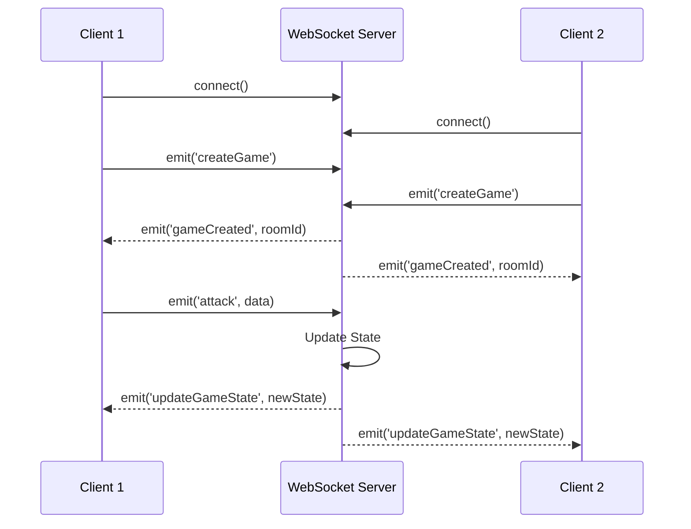

# Real-Time WebSocket Engine

[](https://nodejs.org/)
[](https://socket.io/)
[](https://developer.mozilla.org/en-US/docs/Web/API/WebSockets_API)

> **Real-time multiplayer engine** demonstrating bidirectional WebSocket communication for low-latency state synchronization.

## 🎯 Core Features

- **WebSocket Communication**: Persistent connections for sub-100ms latency
- **Event-Driven Architecture**: Server-authoritative state management
- **Room-Based Broadcasting**: Efficient multi-client synchronization

## 🏗️ Architecture

**WebSocket Flow**: `Client Event → Server Validation → State Update → Broadcast to Room`



**Why WebSockets?**
- **Persistent Connection**: No HTTP handshake overhead per message
- **Bidirectional**: Server can push updates without client polling
- **Low Latency**: ~10-50ms vs ~100-300ms for HTTP requests

## 🔧 Technical Implementation

### Server-Side Event Handling
```javascript
io.on('connection', (socket) => {
  // Room-based matchmaking
  socket.on('createGame', () => {
    const roomId = roomCounter;
    socket.join(roomId);
    if (games[roomId].length === 2) {
      io.to(roomId).emit('gameCreated', roomId);
      roomCounter++;
    }
  });

  // State synchronization
  socket.on('attack', ({ roomId, playerName, attackType }) => {
    // Validate and update server state
    gameStateDb[roomId].enemyHealth -= damage;
    // Broadcast to all clients in room
    io.to(roomId).emit('updateGameState', gameStateDb[roomId]);
  });
});
```

### Client-Side WebSocket Connection
```javascript
const socket = io();

// Listen for state updates
socket.on('updateGameState', ({ gameState }) => {
  clientGamestate = gameState;
  updateUI(gameState);
});

// Emit actions to server
socket.emit('attack', { roomId, playerName, attackType });
```

## 💡 Key Challenges Solved

**1. Disconnect Handling**
- Automatic room cleanup on disconnect
- State garbage collection prevents memory leaks

**2. State Synchronization**
- Server-authoritative model prevents client manipulation
- Atomic state updates ensure consistency

**3. Latency Optimization**
- Minimal payload sizes
- Event-driven updates (no polling)

## 🚀 Getting Started

```bash
# Clone repository
git clone https://github.com/Gh0stbasta/bloodKatana.git
cd bloodKatana

# Install dependencies
npm install

# Start server
npm run dev
```

**Testing Multiplayer**: Open `http://localhost:3000` in two browser windows to test real-time synchronization.

## 📊 Tech Stack

**Backend**: Node.js, Express, Socket.IO  
**Frontend**: Vanilla JavaScript, Socket.IO Client  
**Protocol**: WebSocket (RFC 6455)

---

**Built to demonstrate WebSocket-based real-time state synchronization patterns.**
